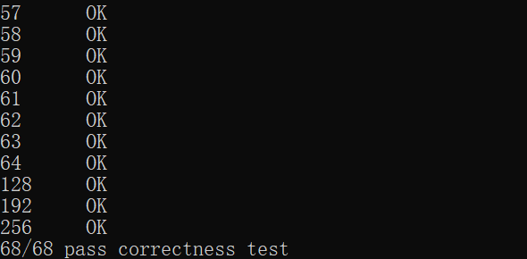
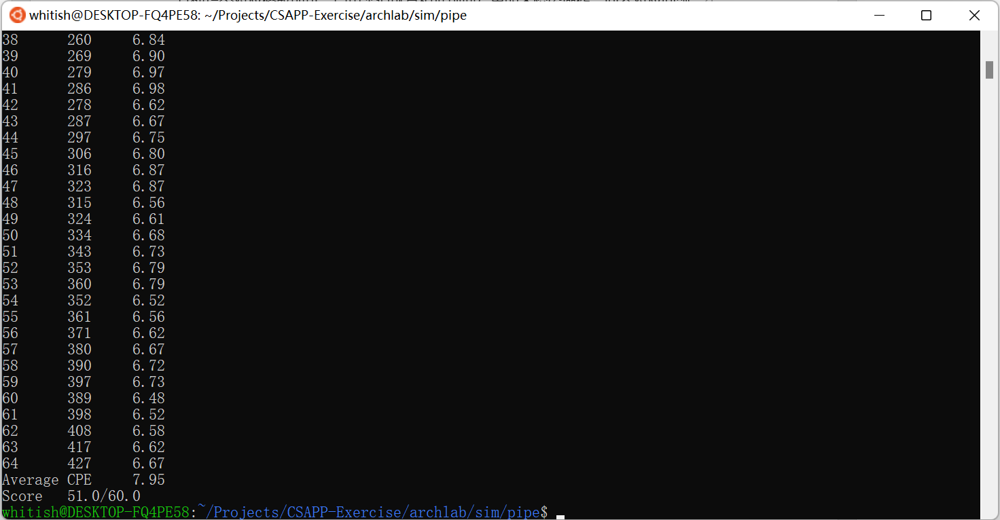
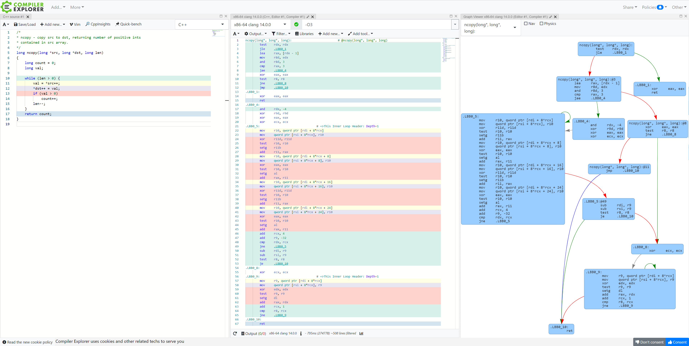

## archlab笔记

最终还是没能逃掉AT&T汇编（悲）。但是说实话，本人很不喜欢Y86-64汇编这种一次性的语言，在除了这个作业以外的其他地方都没有用处。虽然理解作者的教学目的，但是觉得直接讲授x86汇编等实际可用的语言效果会更好。

1. sum.ys

    注意作者没有实现`ret n`指令，并且为了更加契合C语言程序，这里使用__cdecl调用约定，从右向左将传入参数压栈，例程执行结束后由调用方负责恢复堆栈。之后正常地编写汇编语言程序即可。

    另外这里因为整个程序十分简单，所以在进入例程时就不再特意储存寄存器的值了。实际编写较为复杂的程序时可以使用`push`、`pusha`等命令或者`USES`伪指令等保护之后要进行修改的寄存器。

2. rsum.ys

    递归程序，注意进入例程和从例程返回时需要保证堆栈正确。另外，本人在实现时使用rcx寄存器保存局部变量`val`，在递归调用`rsum_list`时需要保存rcx寄存器。

3. copy.ys

    没有难度。

4. seq-full.hcl (Part B)

    `iaddq`的指令总长度为10Byte，编码如下图所示：

    

    之后仿照书籍第266页的图4.18，写出`iaddq`在各个阶段的详细操作如下：

    ```
    fetch:   icode:ifun <- M1[PC]
                  rA:rB <- M1[PC + 1]
                   valC <- M8[PC + 2]
                   valP <- PC + 10
    decode:        valB <- R[rB]
    execute:       valE <- valB + valC
                    Set CC
    memory:
    write back:   R[rB] <- valE
    PC update:       PC <- valP
    ```
    接下来需要修改后面的控制信号定义，为`iaddq`注册它所需要用到的信号或操作。例如：`iaddq`的指令编码中需要指定寄存器ID(也就是rB)，那么就需要做出下面的修改，将IIADDQ加入need_regids对应的指令集合中：

    ```
    # Does fetched instruction require a regid byte?
    bool need_regids =
        icode in { IRRMOVQ, IOPQ, IPUSHQ, IPOPQ, 
                IIRMOVQ, IRMMOVQ, IMRMOVQ, IIADDQ }; # Add IIADDQ to this set.
    ```

    其他指令对应修改即可，简单来说就是根据前面写出的各阶段操作，回答对应问题。

5. pipe-full.hcl (Part C)

    仿照前面的seq-full.hcl进行修改即可。

6. ncopy.ys

    展开循环对代码性能进行优化。展开循环的一个突出贡献在于它可以增多每次循环中的数据依赖，如果每次循环只访问一个地址的数据，那么如果缓存没有命中，那么CPU只能花更长的时间去等待访存，而如果每次循环访问更多的数据，那么即使有一两个没有命中缓存，CPU也可以更快地访问其他在高速缓存中的数据。

    阅读书籍中的5.8节，对`ncopy`进行展开即可，本人实现时每次循环访问6个元素，最终成绩为51/60。

    正确性测试：

    

    性能测试：

    

    其实，个人认为实际编程时将展开循环的工作交给编译器来做就可以了，现代的硬件和编译器已经足够聪明了。如果希望进一步学习展开循环相关的知识，可以参考下面的一些资料：

    可以参考编译器对`ncopy`代码的优化，下面贴出了clang的O3级别优化代码：

    

    另外一篇关于源代码优化的展示：[compiler_survey_felix_von_leitner.pdf (linux-kongress.org)](http://www.linux-kongress.org/2009/slides/compiler_survey_felix_von_leitner.pdf)
