## attacklab笔记

1. 对于ctarget，根据作业提示和主函数逻辑，可以很快定位到存在漏洞的函数`getbuf`地址为004017A8。

    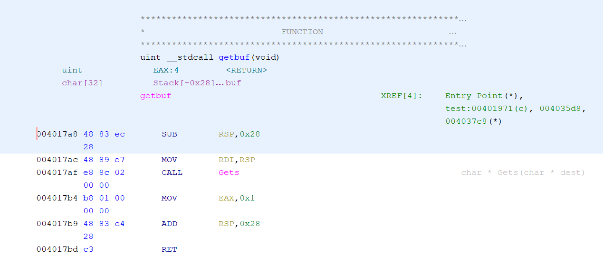

    此外，作业文档中提到，ctarget程序多次运行时都会使用同一个固定的位置作为它的堆栈，因此之后的实验不需要考虑地址变化问题。

2. `touch1`函数地址为004017C0。

    根据`getbuf`的反汇编代码，构造输入文件，前40字节为任意非0字节，紧随其后放置`touch1`函数的地址即可，详细内容如下：

    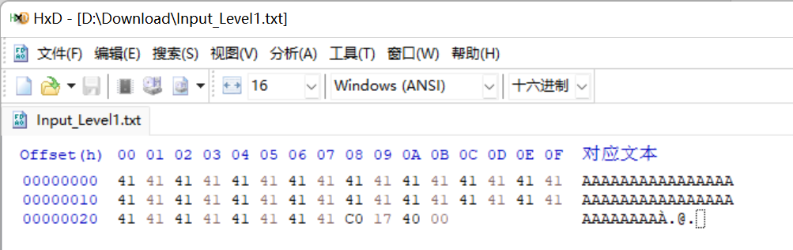

    实际上，此程序中使用的读入字符串的方法`gets`反编译代码如下：

    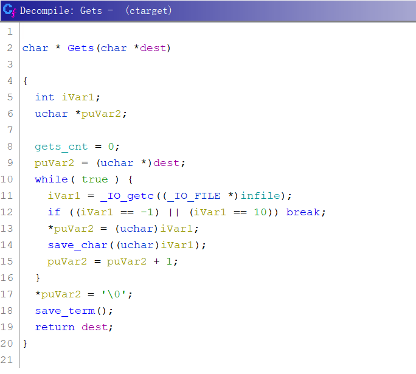

    也就是说，`gets`只有遇到EOF或换行符‘\n’才会停下，并在已读入的字符串末尾添加一个结束符‘\0’。这种读入方式并不会因为字符串中出现的‘\0’而停下。因此，有以下两点需要注意：

    a)	如果有强迫症，也就是希望淹没返回地址后不淹没多余的字节，则可以将Input_Level1.txt中最后的00删去，gets读入后会补上一个00。

    b)	`gets`不会因为遇到‘\0’而停下，但现实中大多程序则会停下，个人建议应尽量避免在shellcode中出现字节00。

    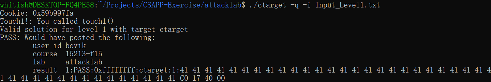

3. `touch2`函数地址为004017EC。

    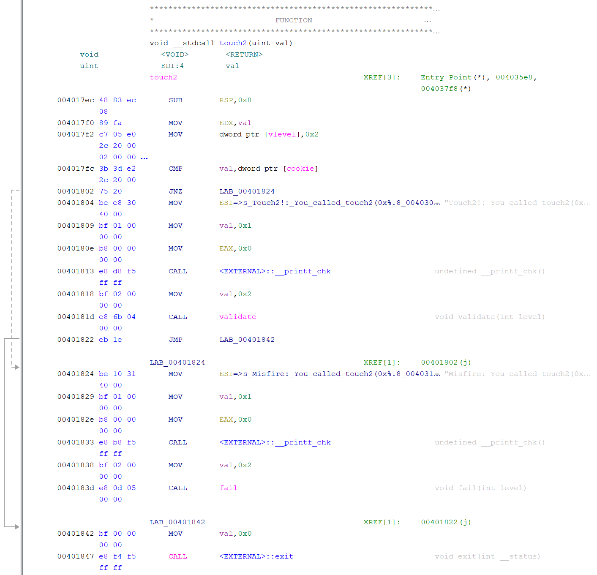

    调用`touch2`的时候，变量`val`储存在寄存器edi中，而`cookie`值为0x59B997FA，`val`也应设为这个数值。因此，我们需要在shellcode中编写类似如下的汇编代码：

    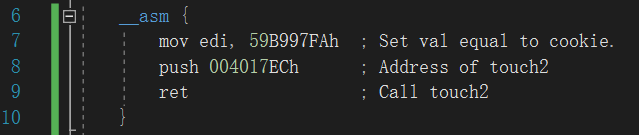

    对应机器码为：

    `bf fa 97 b9 59 68 ec 17 40 00 c3`

    如果希望避免shellcode中出现00，可以使用一个简单的异或编码：

    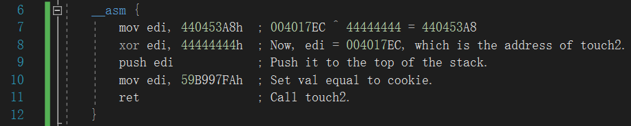

    对应机器码为：

    `bf a8 53 04 44 81 f7 44 44 44 44 57 bf fa 97 b9 59 c3`

    最后得到的完整输入为：

    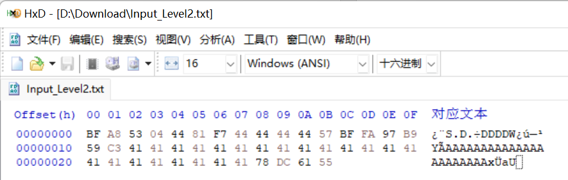

    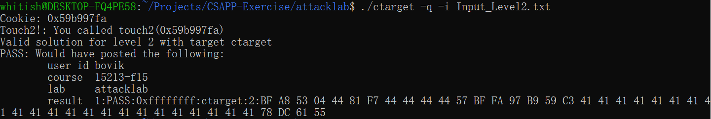

4. `touch3`函数地址为004018FA。

    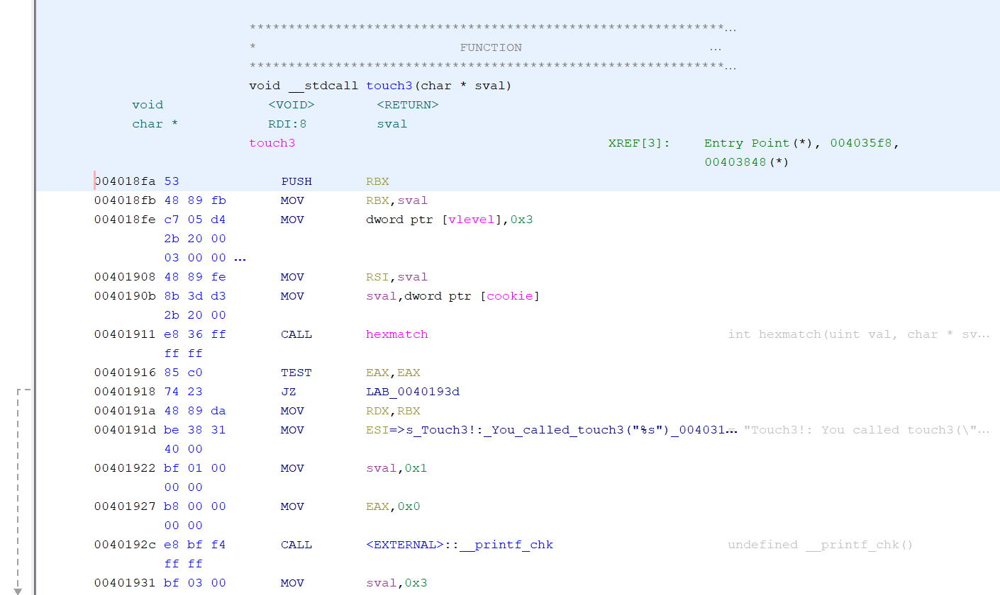

    使用寄存器edi储存`sval`的值。这一题与`touch2`不同之处在于，`sval`(也就是edi寄存器)应指向一个存放`cookie`对应字符串的地址；`getbuf`的调用约定是stdcall，返回前已还原esp，也就是在执行shellcode时，缓冲区已在栈外。当我们在shellcode中调用`touch3`时，`hexmatch`函数会申请一个较大的空间，这时会把我们原先存放shellcode的缓冲区覆盖掉。

    很简单，我们在溢出缓冲区时多溢出一点，覆盖掉`test`函数的一些栈帧，并在那里存放字符串即可。因为`test`函数从未返回，因此它的栈对于`touch3`来说一直是完整且不会被覆盖的。

    shellcode代码为：

    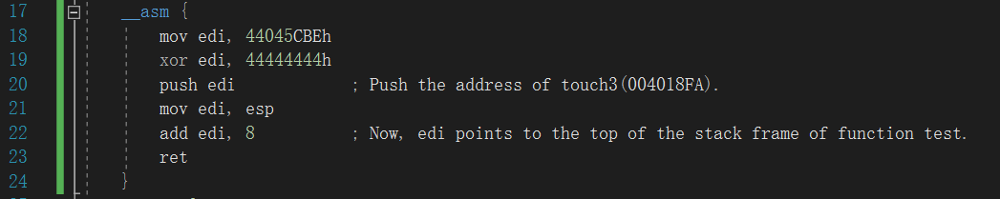

    其中，在执行这段shellcode前，esp指向`test`栈顶，由于需要push `touch3`的地址，压栈的过程中esp发生了变化，因此需要设置`edi = [esp + 8]`，以修正这个偏移。

    输入为：

    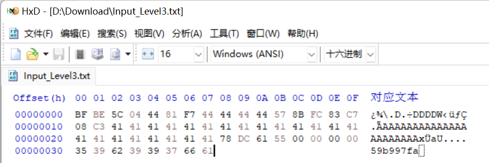

    与前面两个文件相比，多覆盖了一段空间为`cookie`对应文本“59b997fa“的ASCII码。虽然程序代码多使用32位的寄存器进行寻址，但程序本身为64位，地址也应使用64位地址，且每次压栈也以8字节为单位。

    另外，这里出现的连续4个字节的0没有特别简单的方法来避免了，因为它和前面4个字节共同组成了缓冲区首地址。

5. 对于rtarget中的已有函数，有下列函数可用：

    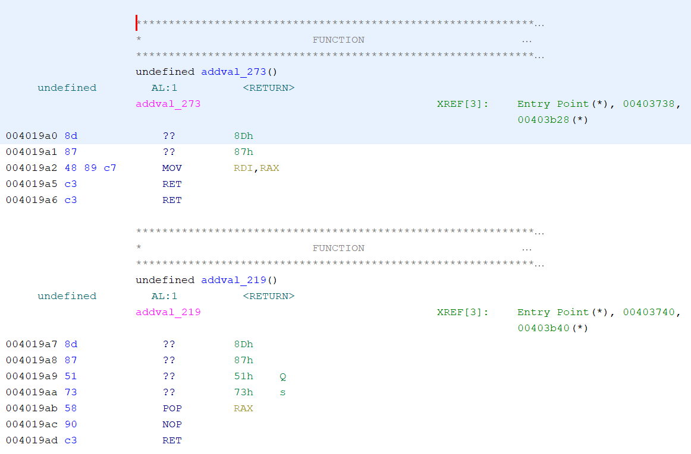

    据此，可以设计输入如下：前40字节任意，然后跟随00000000004019AB来淹没`getbuf`的返回地址，之后是8字节的`cookie`的值，之后再加上地址00000000004019A2，最后是`touch2`的地址00000000004017EC。如此设计可以使得程序改变为：从缓冲区中取出8字节置于rax，而这里取出的正好是`cookie`的值。然后，执行`ret`指向的`mov rdi, rax`，也就是将edi也设为`cookie`的值。

    输入具体如下：

    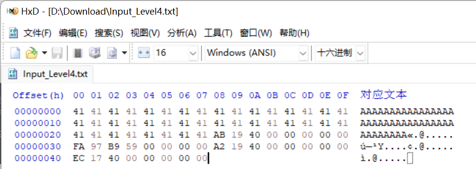

    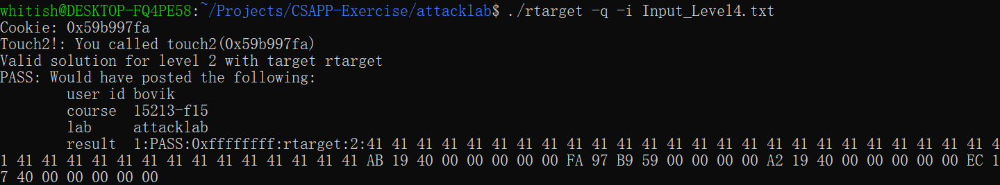

6. 对于给出的farm.c中的代码，它们的另外一种解析形式列出在AlternativeFarmCode.c中。

    参照ctarget的`touch3`实验中的shellcode：

    

    则可以使用已有的代码构造出如下代码，实际上就是将值左手倒右手：

    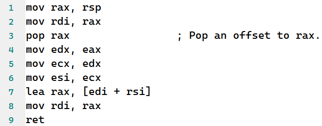

    对应的输入构造为：40字节任意字符 + 0000000000401A06 + **00000000004019A2** + 00000000004019AB + 0000000000000048(此时，rdi中储存的地址指向前面的**00000000004019A2**，距离后面的字符串有72字节) + 00000000004019DD + 0000000000401A34 + 0000000000401A13 + 00000000004019D6 + 00000000004019A2 + 00000000004018FA(`touch3`的地址) + `35 39 62 39 39 37 66 61`(cookie“59b997fa”)。

    构造输入文件如下：

    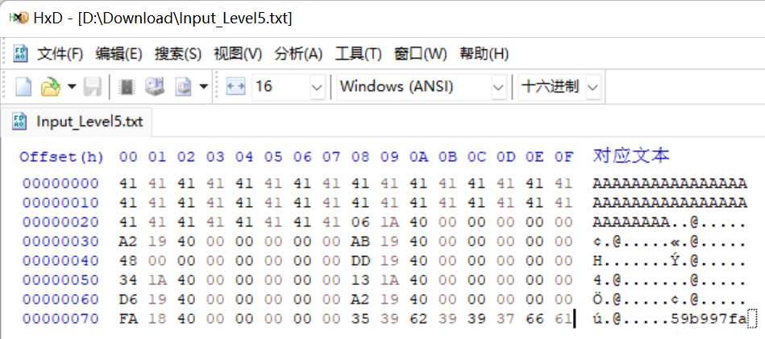

    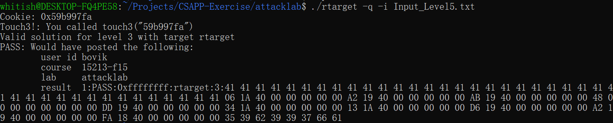
