## bomblab笔记

这里选择纯静态分析，使用[Ghidra](https://ghidra-sre.org/)进行反汇编和反编译，这样可以直接查看Intel风格的汇编代码，而且根本无需运行程序。作业中没有提到必须使用gdb，而且本人实在不习惯AT&T的汇编风格。

1. main函数地址：0x00400DA0，反编译代码如下：

    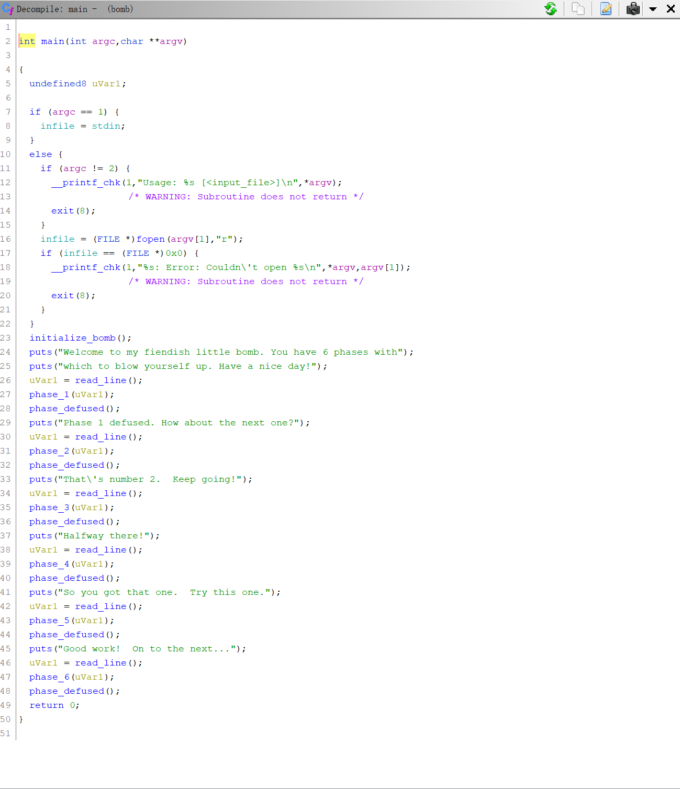

2. phase_1:

    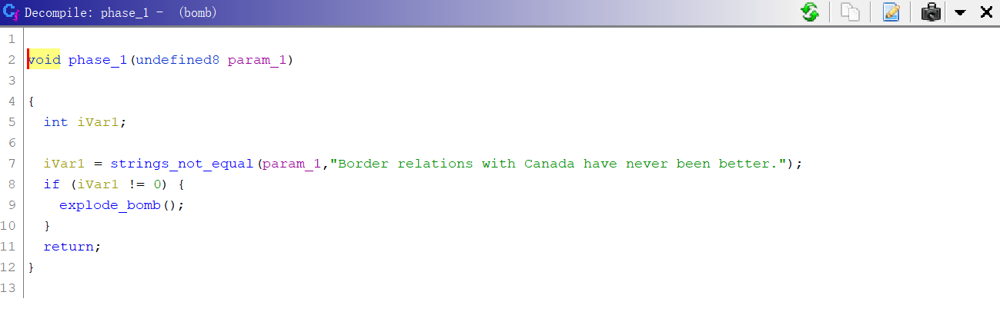

    答案：Border relations with Canada have never been better.

3. phase_2:

    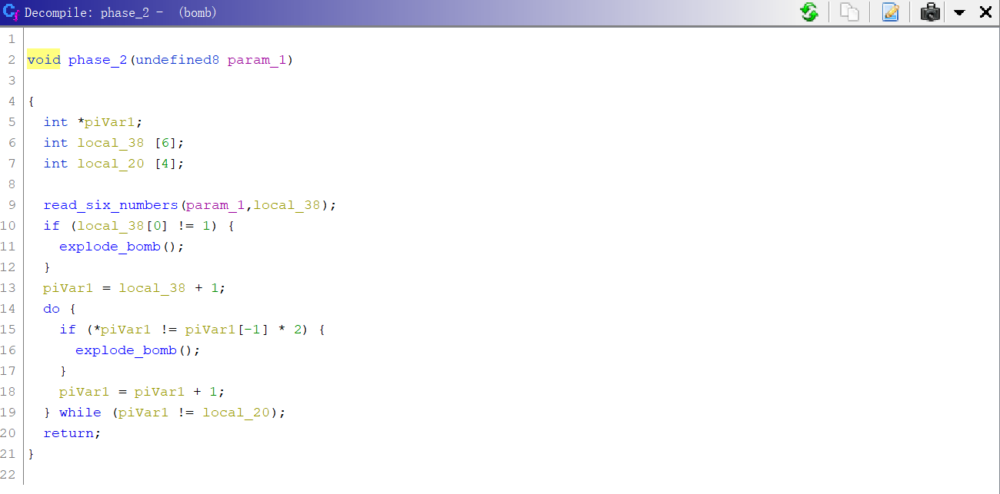

    其中的`read_six_numbers`读取六个整数(读取时以空格分开)，存放在数组`local_38`中。之后的流程为：

    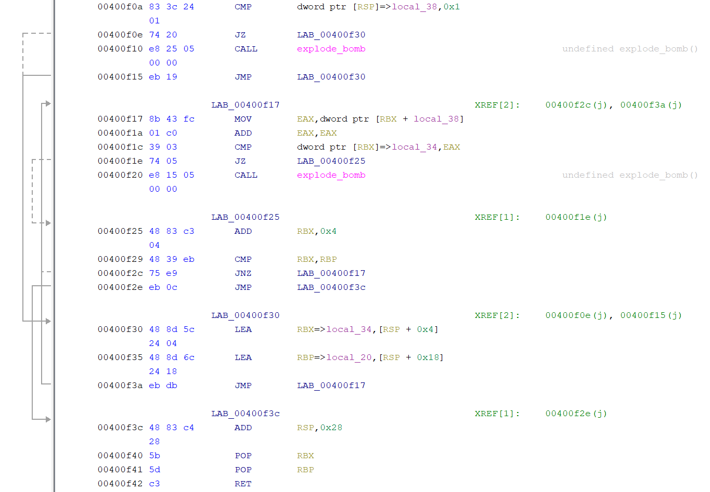

    第一个数为1，后续的数应为前一个数的2倍。

    答案：1 2 4 8 16 32

4. phase_3:

    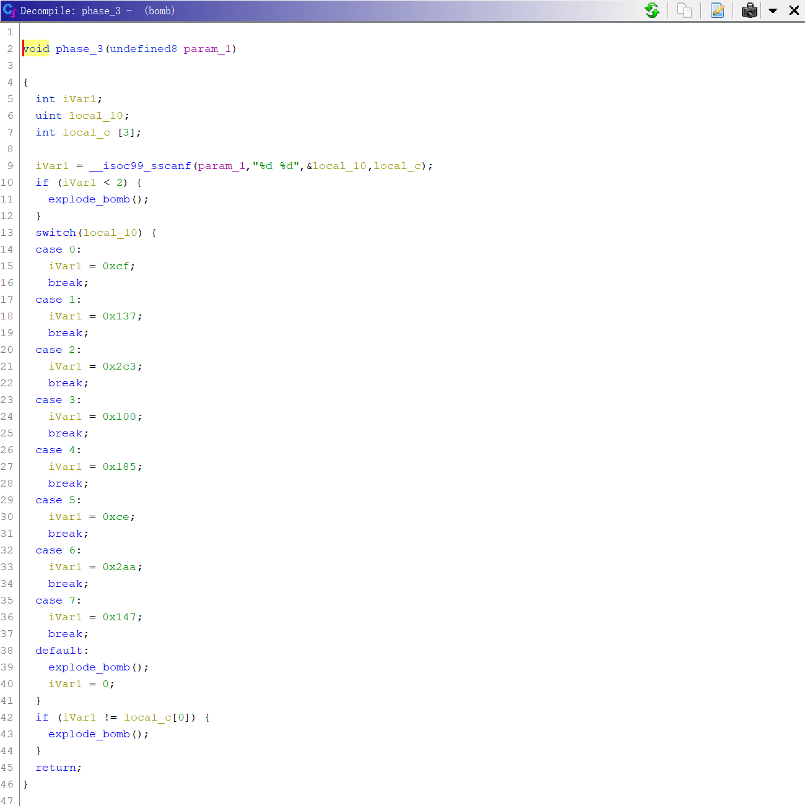

    读入两个数，有以下几种合法组合：

    答案：0 207或1 311或2 707或3 256或4 389或5 206或6 682或7 327

5. phase_4:

    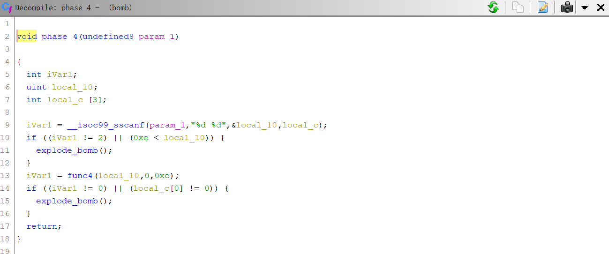

    读入两个数，第一个数应小于等于14，第二个数应为0。难点在于第一个数的校验，程序向函数`func4`传入参数(第一个整数, 0, 14)，我们应让它返回0：

    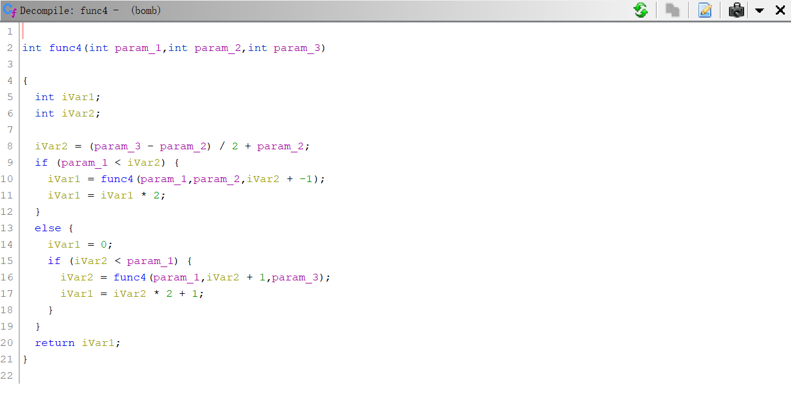

    一个递归函数，但对于我们而言，让返回值为0即可，注意到`iVar2`为`param_2`和`param_3`的平均数，当`param_1`等于`iVar2`时，`func4`返回0。因此，`param_1`取0和14的平均数，也就是7时，`func4`返回0。

    答案：7 0

    事实上，当$param\_1=param\_2+\frac{param\_3-param\_2}{2^n}$ ,n∈N时，`func4`的返回值均为0，也就是说第一个整数的合法取值为0，1，3，7。

6. phase_5:

    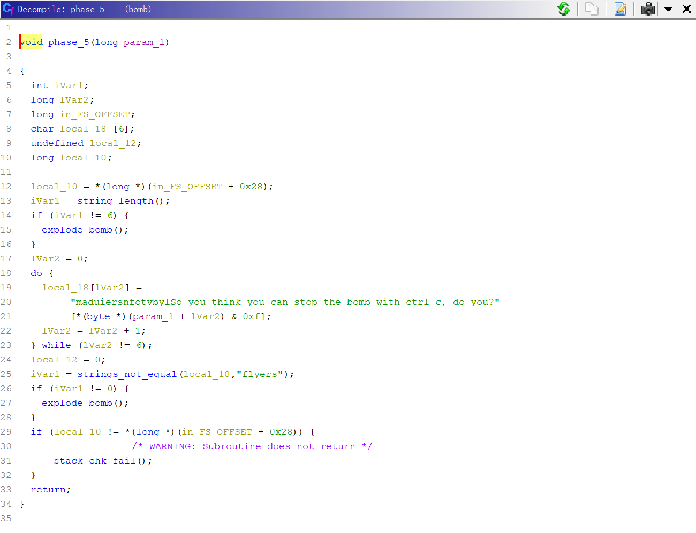

    首先检查读入的字符串长度应等于6，然后关键点在于执行图中反编译代码的第18-23行，也就是根据输入的字符串(`param_1`指向的字符串)算出一个偏移值，然后根据这个偏移值从”maduiersnfotvbylSo you think you can stop the bomb with ctrl-c, do you?”的前16个字符中取出字符，组成”flyers”即可。

    根据规则，有效字符偏移为9(0x9)，15(0xF)，14(0xE)，5(0x5)，6(0x6)，7(0x7)。由于我们输入的应该是可显示的ASCII字符，低4位为上面的数字，高4位任意选择即可。
    
    一个可能的答案为：IONEFG

7. phase_6:

    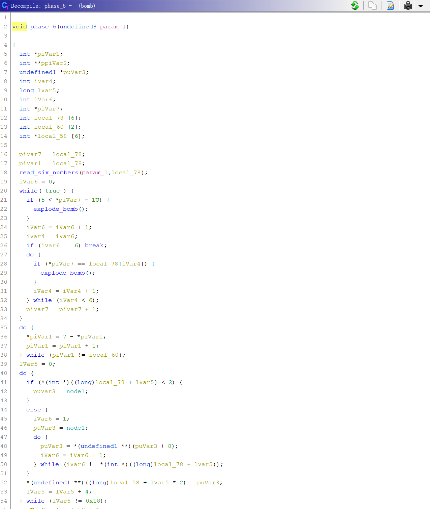
    
    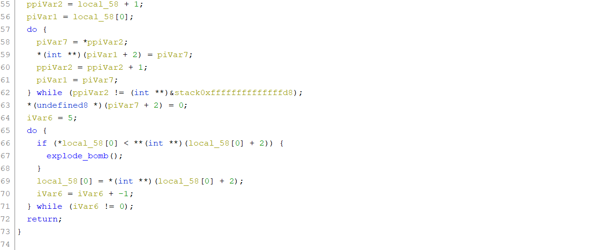

    代码较长，逐行理解如下：

    第18行：将输入的字符串解析成6个整数，以空格隔开。

    第21行：输入的6个整数均不得大于6。

    第27-32行：输入的六个数中，位于后面的数字不可以与位于前面的数字相等。也就是说，六个整数互不相同。

    第35-38行：将每个整数作为减数，7作为被减数进行运算，并将对应的结果储存在对应的位置。例如原来的数是1，那么执行这段代码后变为6(7 – 1 = 6)。

    第39行后的代码由于涉及链表，这里根据观察修正反编译代码中的数据结构并重命名其中的一些局部变量，更新代码如下(原39行对应新的42行，为便于理解，变量名命名方式采用系统匈牙利命名法)：

    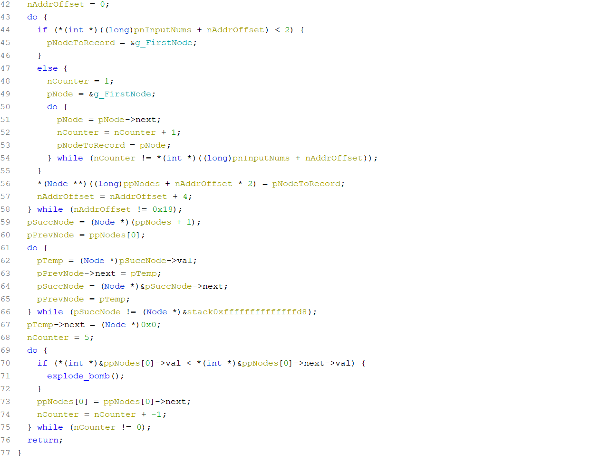

    其中`g_pFirstNode`为全局变量，Node定义如下：

    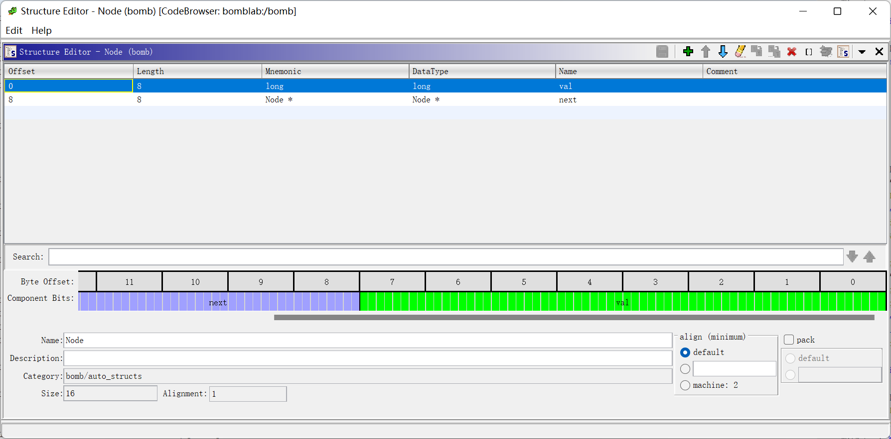

    完整的反编译代码见文件phase_6_discompiled.c。

    第42-58行的意义为：遍历`pnInputNums`数组，也就是输入的那些数被7减后的数组，如果当前数n小于2(也就是等于1)，则将全局变量`g_FirstNode`的地址记入`ppNodes`数组中n的对应位置，否则从`g_FirstNode`开始遍历到第n个链表节点，并将这个节点的地址记录到`ppNodes`数组中n对应的位置。

    `g_FirstNode`开始的一段空间为全局变量，接连摆放了6个Node，各个Node按次序连接起来，它们的`val`依次为0x10000014C，0x2000000A8，0x30000039C，0x4000002B3，0x5000001DD，0x6000001BB。

    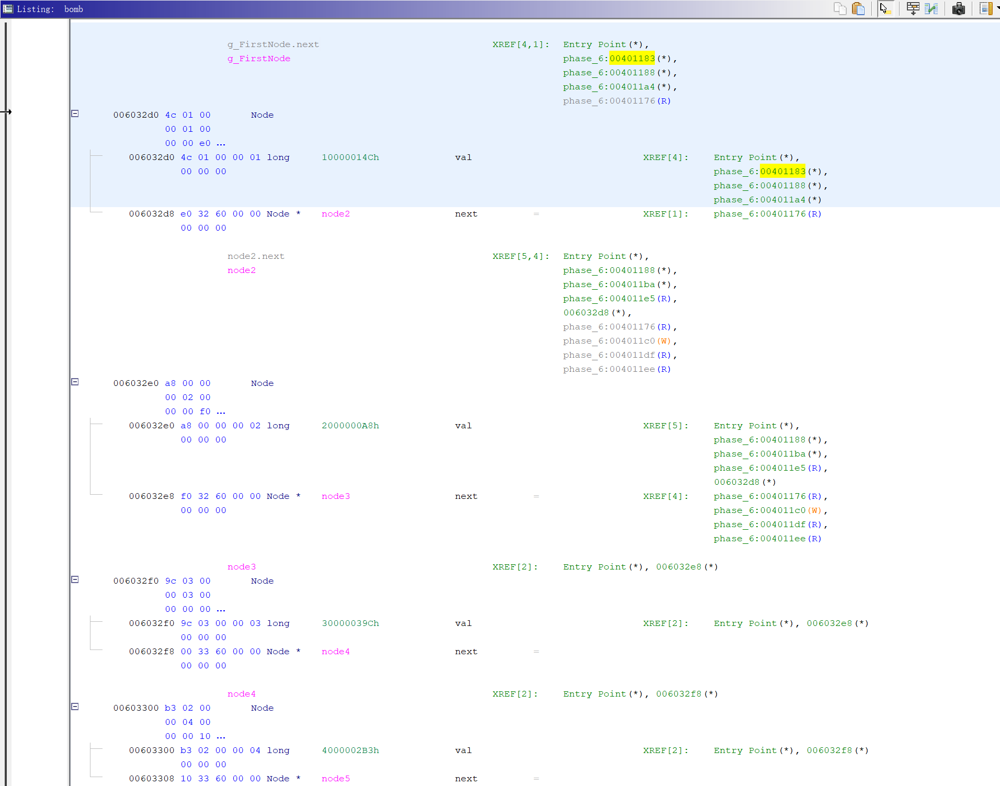

    也就是说，42-58行把`pnInputNums`数组当作每个节点的排序，将`g_FirstNode`及其之后的共6个节点按照这个顺序记录它们的地址，保存到`ppNodes`数组中。然后，59-67行用这个新顺序更新它们的`next`指针。

    最后，69-75行检查重新排序后的链表，对于相邻的两个节点，将它们的`val`强制转换为32位有符号整数(int)之后进行比较，要求非增序，否则执行`explode_bomb()`。
    
    `g_FirstNode`及其之后的共6个节点的`val`转换为32位有符号整数后，分别为0x0000014C，0x000000A8，0x0000039C，0x000002B3，0x000001DD，0x000001BB。它们的降序排列为3->4->5->6->1->2。还原到最初的输入序列，可以得到：

    答案：4 3 2 1 6 5

8. 综合以上所有答案，成功解除炸弹：

    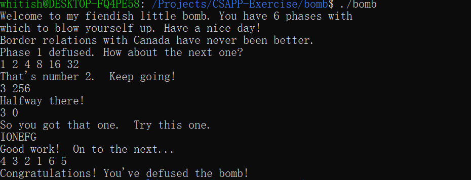
