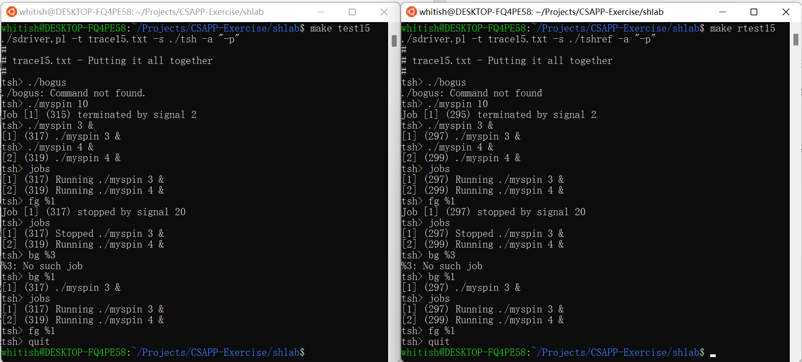

## shlab笔记

本次实验无明显难点，主要任务是阅读书籍的第8章，学习Linux系统的进程和信号的相关概念和基本操作。具体实验内容可以参考书籍中对重点API的解释和示例，对照实现即可。

1. Linux API相关文档可以查阅：[Linux manual pages: section 3 (man7.org)](https://man7.org/linux/man-pages/dir_section_3.html)

2. `eval`函数：仿照书籍中的525页完成基本功能。然后，需要增加代码使得tsh创建子进程后将它添加到作业列表中。这里需要注意一个竞争情况，如果子进程很快就能返回，那么它可能在父进程执行`addjob`之前便返回，向父进程发送SIGCHLD信号。父进程立刻处理这个信号，执行`deletejob`，然后才回过来执行`addjob`，导致子进程还没有加入作业列表便被删除，不符合本意。因此需要参考作业文档中的第6条提示(或者书籍中的第541-543页)，在`fork`前阻塞SIGCHLD信号，直到父进程有机会正确地将子进程加入到作业列表之后再取消阻塞。

    另外，作业文档中的第8条提示指出，tsh创建的子进程默认同属于tsh所在的进程组，这样会使得子进程在执行时接收到的<kbd>Ctrl</kbd>-<kbd>C</kbd>同样会影响到tsh本身(以及其他由tsh创建的子进程)，不符题意。因此，需要在子进程执行`execve`前设置子进程的进程组号以使其从tsh所在的进程组中分离。

3. `builtin_cmd`函数：仿照书籍中的525页完成基本功能，并按照作业文档添加`jobs`、`bg`、`fg`命令的相关代码。注意tsh对于单个的’&’会认为其是内建命令并忽略它。

4. `do_bgfg`函数：仿照参考实现的输入输出，对应实现即可。对指定的进程发送SIGCONT信号，并在作业列表中修改它的前后台状态。

5. `waitfg`函数：参考作业文档中的第5条提示，在`waitfg`中循环等待进程终止，而将它的回收工作放在信号处理函数`sigchld_handler`中。

6. `sigchld_handler`函数：参考书籍的第517页，回收已终止的子进程并将其从作业列表中删去，对于因为接收到信号而停止的子进程，修改其在作业列表中的状态。

    > 参考：[wait(3p) - Linux manual page (man7.org)](https://man7.org/linux/man-pages/man3/wait.3p.html)
7. `sigint_handler`和`sigstp_handler`函数：按照<kbd>Ctrl</kbd>-<kbd>C</kbd>和<kbd>Ctrl</kbd>-<kbd>Z</kbd>的本意实现即可。

最终效果如下：

